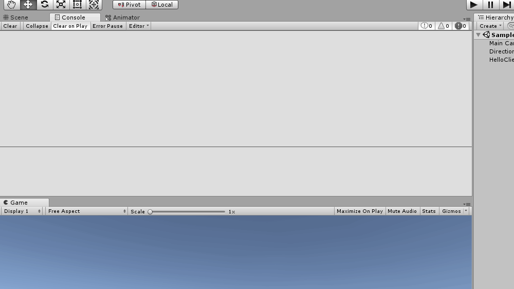

# Unity3D-Python-Communication

⚡️ A very fast, simple, and general inter-process communication example between Unity3D C# and Python, using ZeroMQ.

PS. It looks slow in the GIF above because I put a delay of one second between each message so that you can see it
working.

## Core Pillars

- **very fast** — ZeroMQ is a networking library that allows you to send huge amount of data from server to client in a short period of time. I'm talking about casually sending/receiving 10,000 requests per second.
- **simple** — You don't have to explicitly open and bind a socket or know anything about low-level networking.
- **general** — You can use this to send/receive any kind of data request. You can send image, video, text, JSON, file, or whatever you want. In this example, we are sending text.
- **inter-process** — The communication is done inside the same machine. Which means very low-latency.

## Introduction

* Have you ever tried to communicate C# code in Unity3D with Python before but could not find a satisfying solution?
* Have you ever tried implementing communication protocol using file read/write and found out that it's a stupid approach?
* Have you ever tried communicating using Web HTTP request and found out that it's stupidly slow and high latency?
* Have you ever tried communicating using socket/TCP/UDP stuff, but it feels like you are reinventing the wheel and you
  are becoming a network engineer?
* Have you ever tried to communicate by emulating a serial port, and found out that it's not how cool guys do work?
* Have you ever tried to send Unity input to python and do some scientific work (maybe even machine learning task)
  and return the output to Unity?
* Have you ever tried to build a `.dll` from python or even rewrite everything in `C#` because you don't know how to
  communicate between python and C# processes?
* Have you ever tried to embed `IronPython` or `Python.NET` inside Unity but it doesn't allow you to install your
  amazing external python libraries? (And its minimal power is pretty ridiculous compared to your external python)
* Have you ever tried to export a `TensorFlow Protobuf Graph` (Deep learning model) and use `TensorFlowSharp` or
  `OpenCVForUnity` to import the graph inside Unity because you want to use the model to predict stuff in Unity, but it
  doesn't allow you to use/utilize your new NVIDIA GeForce 1080Ti GPU, and it's also hard to code?
* Tried `MLAgents`, anyone?

If you answer **Yes** to any of these questions but it seems you have found no solutions,
then this repository is definitely for you!
(If you answered **Yes to all** questions, you and me are brothers! 😏)

I've tried a lot. With a lot of searching on the internet, I've found no solutions that is simple, fast, and general
enough that I can apply to any kind of communication between Python and Unity3D. All I've done in the past were simply
a hack to either get my scientific computation work in Unity instead of python, or communicate between the processes painfully.

_Until I found ZeroMQ approach from this [repository](https://github.com/valkjsaaa/Unity-ZeroMQ-Example)
(and some head scratching)._

## Solution Explanation

I've built a `request-reply` pattern of ZeroMQ where Python (server) replies whenever Unity (client) requests
a service from Python.

The idea is to create a separate thread inside Unity that will send a request to python, receive a reply and log the reply
to the console.

Most of the code are just copies from the official ZeroMQ tutorial. I try to make this as simple to grasp as possible,
so I only log the message to the console and nothing fancy.

## Getting Started

1. Clone this repository using `git clone https://github.com/off99555/Unity3D-Python-Communication.git` command.
2. Open UnityProject (its `dll` files are targeting .NET 4.x version) and run `Assets/NetMQExample/Scenes/SampleScene`.
3. Run python file `PythonFiles/server.py` using command `python server.py` on a command prompt.
4. You should start seeing messages being logged inside Unity and the command prompt.

Specifically, Unity will send request with a message `Hello` 10 times, and Python will simply reply `World` 10 times.
There is a one second sleep between each reply on the server (to simulate long processing time of the request).

Please read the comments inside `PythonFiles/server.py` and `UnityProject/Assets/NetMQExample/Scripts/` and you will
understand everything more deeply.

**The most important thing is that you should follow the 4 getting started steps first. Don't skip it!** ❣️

After you've understood most of the stuff but it's not advanced enough, you should consult the official
[ØMQ - The Guide](http://zguide.zeromq.org/page:all).

## Requirements

* [PyZMQ](https://pyzmq.readthedocs.io/en/latest/) is the Python bindings for [ZeroMQ]((http://zeromq.org/)). You can install it using
  `pip install pyzmq` command or see more installation options [here](http://zeromq.org/bindings:python) or
  [here](https://github.com/zeromq/pyzmq).
* [NetMQ](https://netmq.readthedocs.io/en/latest/) is a native C# port of ZeroMQ. Normally you need to install this using
  `NuGet` package manager inside `Visual Studio` when you want to build a .NET application, or you could install using
  `.NET CLI`. But for this repository here, you don't need to do any of the installation because we've already included
  `AsyncIO.dll` and `NetMQ.dll` for you inside `UnityProject/Assets/NetMQExample/Plugins/` directory.
  If you want to build your own `dll` files, please take a look at
  [this issue](https://github.com/valkjsaaa/Unity-ZeroMQ-Example/issues/7).

## Known Issues
Based on [this issue](https://github.com/zeromq/netmq/issues/631), the NetMQ implementation is not working nicely with Unity. If you create more than one ZeroMQ client in Unity, the Unity editor will freeze.

## Troubleshooting

* While both server and client are running and communicating fine, I kill the server process, restart the server, then both server and client seem to not be communicating anymore. Why don't they continue communicating? Is this a bug?

  No, this is the expected behavior of ZeroMQ because of the simplicity of the code. It's mentioned in the guide
  [here](http://zguide.zeromq.org/page:all#Ask-and-Ye-Shall-Receive). If you want to make the code better, which is not
  the focus of this example, you can learn more about ZeroMQ as suggested in the screenshot below.
  
  
  The problem is that when you restart the server, the server won't reconnect to the old client anymore. You have to restart the client also.

## TODO

* [ ] Add example that use Unity's Update() method to receive reply instead of using a separate thread to continuously
    call `TryReceiveFrameString()` in a loop without any delay. This means that
    the call to `TryReceiveFrameString()` will not be too frequent which yields better performance. It will be called
    only about 60 times a second if the frame rate is 60 FPS inside Update() method.
    The benefit of no separate thread is that there will be no thread-swapping overhead.
